# Voice AI Over the Phone: A Practical Guide with Pipecat and Twilio

A few weeks ago, I was scrolling through my feed and kept seeing demos of voice AI assistants. People were having full conversations with AI over the phone - not the clunky "press 1 for billing" kind, but actual back-and-forth dialogue. It sounded natural. It sounded *fast*.

My first thought was: "That's cool, but it's probably built by a team of 20 engineers at some well-funded startup."

My second thought was: "...but what if it's not?"

So I went down the rabbit hole. I've been a full-stack developer for years - I'm comfortable with APIs, backends, cloud infrastructure, all of that. But telephony and audio processing? That was completely new territory for me. I wanted to see if I could build a voice AI that answers real phone calls. Not a toy demo. A real phone number you can call, have a conversation with, and hang up.

Turns out, the tools have gotten really good. After a weekend of tinkering, I had a working voice bot named Miss Harper - an elementary school teacher who answers phone calls and chats with you in a friendly Australian accent. You call the number, she picks up, says hello, and you can talk to her like a normal person. She listens, thinks, and talks back - all in real time.

Don't take my word for it - here's a recording of an actual call with Miss Harper:

[audio recording]

In this article, I'll walk you through exactly how I built it, step by step. By the end, you'll have your own AI-powered phone number that picks up calls and has conversations. No prior experience with voice, audio, or telephony needed.

Let's get into it.

## What We're Building

Here's the end result: you'll have a phone number. When someone calls it, an AI bot picks up, introduces itself, and has a natural voice conversation with the caller.

Under the hood, the flow looks like this:

```
You call a phone number
       ↓
   Twilio (handles the phone call)
       ↓
   WebSocket (streams audio back and forth)
       ↓
   Pipecat (processes the audio through AI services)
       ↓
   You hear the bot respond
```

The key idea is simple: it's a **pipeline**. Audio goes in one end, gets turned into text, the AI generates a reply, that reply gets turned back into speech, and the speech goes back out. Everything happens in real time - under a second from when you stop talking to when you hear the response.

Here's what the Pipecat pipeline looks like inside - each module feeds into the next, like an assembly line:

```mermaid
graph LR
    A["🎙️ Audio In<br/>(from Twilio)"] --> B["🔇 Noise Filter<br/>(RNNoise)"]
    B --> C["🗣️ Speech-to-Text<br/>(Deepgram)"]
    C --> D["🧠 LLM<br/>(Groq)"]
    D --> E["🔊 Text-to-Speech<br/>(Deepgram)"]
    E --> F["📞 Audio Out<br/>(to Twilio)"]
```



This cascading design is what makes Pipecat powerful. Each piece does one job and passes its output to the next. You can swap any piece out - use a different LLM, a different voice, a different speech recognition model - without touching the rest of the pipeline.

## The Building Blocks

Before we start building, let me introduce the tools we'll use and explain why each one matters.

**[Twilio](https://www.twilio.com/)** is our phone company. It gives us a real phone number and handles all the complicated stuff about connecting phone calls to the internet. When someone calls your Twilio number, Twilio asks your server what to do with the call. Think of Twilio as the bridge between the old-school phone network and our modern AI code.

**[Pipecat](https://docs.pipecat.ai/)** is the glue that holds everything together. It's an open-source framework that lets you build real-time audio AI applications by connecting different services into a pipeline. Instead of writing all the plumbing code yourself - handling audio streams, managing conversation turns, coordinating between services - Pipecat handles all of that. You just tell it what services to use and in what order.

**[Groq](https://groq.com/)** is the brain. It runs the large language model (LLM) - basically the same kind of AI that powers ChatGPT, but running on Groq's super-fast hardware. We use a model called [Llama 3.3 70B](https://www.llama.com/). The speed matters a lot here: in a phone conversation, even a half-second delay feels awkward. Groq is one of the fastest options available.

**[Deepgram](https://deepgram.com/)** pulls double duty - it's both the ears and the mouth. Deepgram's speech-to-text (STT) service listens to what the caller says and converts it to text so the AI can understand it. Then Deepgram's text-to-speech (TTS) service takes the AI's text response and converts it back to natural-sounding speech. We use their "Theia" voice, which has a warm Australian accent.

**[Silero](https://github.com/snakers4/silero-vad)** is the social awareness layer. It handles something called voice activity detection (VAD), which is just a fancy way of saying "it knows when you're talking and when you've stopped." On top of that, we use something called Smart Turn v3, which is smarter than just listening for silence. It uses machine learning to figure out when you've actually finished your thought - not just paused to take a breath. This is what makes the conversation feel natural instead of robotic.

**[Modal](https://modal.com/)** is where our code runs. It's a cloud platform that lets you deploy Python apps without setting up servers. You write your code, run one command, and it's live on the internet with a public URL. It also auto-scales - if nobody's calling, it costs nothing. If ten people call at once, it spins up more workers.

## How It Actually Works

Let me walk you through what happens when someone calls your bot, step by step.

**Step 1: The phone rings.** Someone dials your Twilio phone number. This is a normal phone call - they could be calling from a mobile phone, a landline, whatever.

**Step 2: Twilio asks your server what to do.** The moment the call connects, Twilio sends a message to your server (an HTTP POST request) saying, "Hey, someone's calling. What should I do?" Your server responds with a small piece of XML called [TwiML](https://www.twilio.com/docs/voice/twiml) (Twilio Markup Language). Think of TwiML as a short instruction sheet for Twilio - in our case it just says: "Open a WebSocket connection back to me and start streaming the audio."

A WebSocket is just a persistent two-way connection - think of it like opening a phone line between Twilio and your server where data (in this case, audio) can flow in both directions at the same time.

**Step 3: Audio starts flowing.** Once the WebSocket is open, Twilio starts streaming the caller's audio to your server in real time via [Media Streams](https://www.twilio.com/docs/voice/media-streams) - small chunks of sound, one after another. Your server can also send audio back through the same connection, and Twilio plays it to the caller.

**Step 4: The Pipecat pipeline kicks in.** This is where the magic happens. The audio goes through a series of steps, one after another:

1. **Noise filter** - An [RNNoise](https://jmvalin.ca/demo/rnnoise/) filter cleans up background noise from the caller's audio. This makes the speech recognition more accurate.
2. **Voice activity detection** - Silero detects that someone is actually talking (as opposed to silence or background noise).
3. **Speech-to-text** - Deepgram's [nova-3](https://deepgram.com/learn/nova-3-speech-to-text-api) model converts the spoken words into text in real time.
4. **AI thinking** - The text goes to Groq's Llama 3.3 model, which generates a response based on the conversation history and the bot's personality (defined by a system prompt - more on that later).
5. **Text-to-speech** - Deepgram's Theia voice converts the AI's text response into spoken audio.
6. **Audio out** - The audio streams back through the WebSocket to Twilio, and Twilio plays it to the caller.

All of this happens fast - typically under a second from when you finish talking to when you hear the response. One reason it feels so quick: the LLM doesn't wait until it's finished writing the whole reply before handing it off. It sends words to the text-to-speech service as it generates them, so the caller starts hearing the response while the AI is still thinking of the rest. It works like an assembly line, not a batch job.

**Step 5: Turn detection makes it natural.** Here's a subtle but important piece: how does the bot know when you've finished talking? Simple silence detection would be too aggressive - it would cut you off every time you pause to think. Smart Turn v3 uses machine learning to detect natural endpoints in speech. It understands the difference between a pause in the middle of a sentence and actually being done talking.

**Step 6: The conversation continues.** The bot keeps the full conversation history in memory for the duration of the call, so it remembers what you said earlier. (Each call starts fresh - it doesn't remember previous calls.) If you go quiet for too long (5 seconds), the bot will take the initiative and continue the conversation on its own.

**Step 7: Recording.** The bot kicks off a [Twilio-side recording](https://www.twilio.com/docs/voice/tutorials/how-to-record-phone-calls) via the REST API as soon as the call connects. Twilio records in dual-channel (one channel per participant), so you get clean, separated audio without any memory overhead in your application. Recordings are stored in your Twilio account and accessible from the [Twilio Console](https://console.twilio.com/) or via the API.

## Setting Up Your Own

Ready to build it? Here's what you need.

### Accounts to Create (All Free Tiers Available)

You'll need accounts with four services. All of them have free tiers, and a handful of test calls won't come close to using up the free credits.

1. **Twilio** - Sign up at [twilio.com](https://www.twilio.com/). You'll need a phone number that supports voice calls. Twilio's trial account gives you one for free.
2. **Groq** - Get an API key at [console.groq.com](https://console.groq.com/). The free tier is generous enough for testing.
3. **Deepgram** - Get an API key at [deepgram.com](https://deepgram.com/). Free credits are included when you sign up.
4. **Modal** - Sign up at [modal.com](https://modal.com/). The free tier gives you enough compute for plenty of test calls.

### Deploy the Bot

First, install the Modal CLI and set it up:

```sh
pip install modal
modal setup
```

Clone the repo and set up your keys:

```sh
git clone https://github.com/jaeyow/twilio-chatbot.git
cd twilio-chatbot/inbound
cp env.example .env
```

Open the `.env` file and fill in your API keys:

```
GROQ_API_KEY=your_groq_api_key
DEEPGRAM_API_KEY=your_deepgram_api_key
TWILIO_ACCOUNT_SID=your_twilio_account_sid
TWILIO_AUTH_TOKEN=your_twilio_auth_token
```

Now deploy to Modal:

```sh
modal serve modal_app.py
```

This gives you a public URL that looks something like:
`https://your-workspace--twilio-inbound-bot-serve.modal.run`

### Point Twilio to Your Bot

The last step is telling Twilio to send incoming calls to your bot:

1. Go to your [Twilio Console](https://console.twilio.com/)
2. Navigate to **Phone Numbers → Manage → Active numbers**
3. Click on your phone number
4. Under **Voice Configuration**, set "A call comes in" to:
   - **Webhook**
   - **URL**: paste your Modal URL
   - **Method**: POST
5. Click **Save configuration**

That's it. Call your Twilio number. It might take a second or two to connect the first time (Modal needs to spin up a worker), but then Miss Harper will pick up and greet you. Say something back - you're having a conversation with your own voice AI.

### Running Locally with Docker (Alternative)

If you'd rather run the bot on your own machine instead of Modal, you can use [Docker Compose](https://docs.docker.com/compose/). The main thing you'll need is a way for Twilio to reach your laptop from the internet, since Twilio needs a public URL to send audio to. VS Code has built-in [dev tunnels](https://code.visualstudio.com/docs/editor/port-forwarding) that work well for this.

The steps are: forward port 7860 in VS Code's Ports panel (set it to Public), grab the tunnel URL, then run:

```sh
cd inbound
export PROXY_HOST=your-tunnel-hostname
docker compose up --build
```

Point your Twilio webhook to the tunnel URL instead of the Modal URL, and everything works the same way. See the [repo's README](https://github.com/jaeyow/twilio-chatbot/tree/main/inbound) for the full Docker setup details.

## Giving Your Bot a Personality

The bot's personality comes from one thing: the **system prompt**. This is the instruction you give the AI that tells it who it is and how to behave. Here's the one we use:

> "You are Miss Harper, an elementary school teacher in an audio call. Your output will be converted to audio so don't include special characters in your answers. Respond to what the student said in a short sentence."

You can change this to anything you want. Make it a customer service agent, a language tutor, a trivia host - whatever fits your use case. Just remember to tell it that responses will be read aloud, so it should avoid things like bullet points, URLs, or special characters.

You can also change the **voice**. We use Deepgram's "aura-2-theia-en" voice (a warm Australian accent), but they have [other voices](https://developers.deepgram.com/docs/tts-models) to choose from.

One more thing worth mentioning: if the caller goes quiet for more than 5 seconds, the bot doesn't just sit there in awkward silence. It takes the lead and continues the conversation. In our case, Miss Harper keeps teaching. You can adjust this timeout or change what the bot says when it kicks in.

## What's Next

---

So there you have it - a voice AI that answers real phone calls, built with open-source tools and free-tier cloud services. The whole thing is about 270 lines of Python spread across two files.

But here's what kept nagging me after I got this working: the bot only talks when *I* call *it*. What if I want the bot to pick up the phone and call *someone else*?

That's exactly what I built next - an outbound voice bot that dials people and starts conversations. I'll walk through that in the next article.

If you want to see the full code, it's all in the [GitHub repo](https://github.com/jaeyow/twilio-chatbot/tree/main/inbound). Questions or ideas? I'd love to hear from you.
