# Making AI Call People: Building an Outbound Voice Bot with Twilio and Pipecat

In the [last article](https://github.com/jaeyow/twilio-chatbot/tree/main/inbound), I built a voice AI that answers incoming phone calls. You call a number, an AI named Miss Harper picks up, and you have a real conversation. It was surprisingly straightforward to build, and I was pretty happy with it.

But the moment it worked, a different question started bugging me: *what if the bot could call someone else?*

Think about it. An inbound bot waits for people to call. That's useful - it's basically an AI receptionist. But an outbound bot? That opens up a whole different set of possibilities. Appointment reminders that actually talk to you. Customer check-in calls. Survey bots. Automated outreach. Even something as simple as a daily wake-up call from a friendly AI voice.

The idea seemed harder at first. With inbound, the caller starts things - Twilio just hands the call to your bot. With outbound, *you* have to start the call. Your code has to tell Twilio "dial this number," wait for the person to pick up, and *then* connect the AI. It's a different dance.

But it turns out the core of it - the AI pipeline that listens, thinks, and talks back - is exactly the same. The only difference is the plumbing around it. And once you understand that plumbing, it clicks.

Here's a recording of the outbound bot in action - it dials a number, the person picks up, and the conversation flows naturally:

[audio recording]

In this article, I'll walk through how I built the outbound bot. If you haven't read the first article on the inbound bot, I'd recommend starting there - I cover the basics of the tech stack ([Pipecat](https://docs.pipecat.ai/), [Groq](https://groq.com/), [Deepgram](https://deepgram.com/), and the rest) in more detail. But this article should still make sense on its own.

## Inbound vs. Outbound: What Actually Changes?

Here's the good news: most of the code is the same. The AI pipeline - the part that listens to speech, converts it to text, generates a response, and speaks it back - is identical. Same [Pipecat](https://docs.pipecat.ai/) pipeline. Same [Groq](https://groq.com/) LLM. Same [Deepgram](https://deepgram.com/) for speech recognition and text-to-speech. Same noise filtering. Same smart turn detection.

What changes is **who starts the call** and **how the connection gets set up**.

With the **inbound** bot:
1. Someone calls your Twilio number
2. Twilio asks your server what to do (sends an HTTP request)
3. Your server says "open a WebSocket and stream the audio"
4. The pipeline handles the conversation

With the **outbound** bot:
1. **You** send a request to your own server: "call this number"
2. Your server tells Twilio: "dial +1234567890 and when they pick up, ask me what to do next"
3. The person answers their phone
4. Twilio asks your server what to do (sends an HTTP request)
5. Your server says "open a WebSocket and stream the audio"
6. The pipeline handles the conversation

See the difference? There's one extra step at the beginning - you kick things off instead of waiting. After the person picks up, everything is the same.

But that one extra step means our server needs an additional endpoint (a URL on your server that accepts requests) to handle it. Which brings us to the interesting part.

## The Three-Endpoint Dance

The inbound bot needed just two endpoints:
- **POST /** - Twilio hits this when someone calls. We respond with instructions.
- **WebSocket /ws** - Where the real-time audio streams back and forth.

The outbound bot needs three:

### 1. POST /dialout - "Start a call"

This is where it all begins. You send a request to this endpoint with two pieces of information: the phone number you want to call and the [Twilio](https://www.twilio.com/) phone number to call *from*.

```
POST /dialout
{
  "to_number": "+15551234567",
  "from_number": "+15559876543"
}
```

When this endpoint receives your request, it uses the [Twilio REST API](https://www.twilio.com/docs/voice/api) to start a phone call. It tells Twilio: "Dial this number, and when the person picks up, go to my `/twiml` endpoint to get instructions."

Twilio starts ringing the phone. You get back a response with a call ID so you can track it.

### 2. POST /twiml - "What to do when they answer"

When the person picks up, Twilio needs to know what to do with the call. So it reaches out to this endpoint. Our server responds with [TwiML](https://www.twilio.com/docs/voice/twiml) (Twilio's XML-based instruction language - think of it as a short instruction sheet that tells Twilio how to handle a call) that says: "Open a WebSocket connection to `/ws` and start streaming audio."

There's one clever detail here: we pass the phone numbers (who's calling, who's being called) as parameters in the WebSocket stream. This way, the bot knows who it's talking to and can personalise the conversation.

### 3. WebSocket /ws - "The actual conversation"

This is the same WebSocket endpoint from the inbound bot. Once it's open, audio flows in both directions through [Twilio Media Streams](https://www.twilio.com/docs/voice/media-streams) and the Pipecat pipeline does its thing - listen, think, respond.

Here's the whole flow as a diagram:

```mermaid
graph TD
    A["📤 You send POST /dialout"] --> B["📞 Server tells Twilio<br/>to call the number"]
    B --> C["🔔 Phone rings...<br/>person picks up"]
    C --> D["📋 Twilio fetches<br/>POST /twiml"]
    D --> E["🔗 Server says: open<br/>a WebSocket to /ws"]
    E --> F["🎙️ WebSocket opens<br/>Pipecat pipeline starts"]
    F --> G["💬 Bot greets the person<br/>conversation begins"]
```



The key insight: the three endpoints form a chain. You trigger the first one, and the rest happen automatically. From the person receiving the call, it just feels like their phone rang and someone started talking to them.

## The Pipeline: Same Trusted Stack

The AI pipeline is nearly identical to the inbound version. Same building blocks:

```mermaid
graph LR
    A["🎙️ Audio In<br/>(from Twilio)"] --> B["🔇 Noise Filter<br/>(RNNoise)"]
    B --> C["🗣️ Speech-to-Text<br/>(Deepgram)"]
    C --> D["🧠 LLM<br/>(Groq)"]
    D --> E["🔊 Text-to-Speech<br/>(Deepgram)"]
    E --> F["📞 Audio Out<br/>(to Twilio)"]
```



- **[Deepgram](https://deepgram.com/) [nova-3](https://deepgram.com/learn/nova-3-speech-to-text-api)** for speech-to-text (turning what the person says into text)
- **[Groq](https://groq.com/) with [Llama 3.3 70B](https://www.llama.com/)** for generating responses
- **[Deepgram](https://deepgram.com/) Theia** voice for text-to-speech (turning the response back into natural-sounding audio)
- **[RNNoise](https://jmvalin.ca/demo/rnnoise/)** for cleaning up background noise
- **[Silero](https://github.com/snakers4/silero-vad) VAD + Smart Turn v3** for knowing when the person has finished talking

The main difference is the **system prompt**. Since the bot is the one making the call, it needs to introduce itself and explain why it's calling - you wouldn't want it to just sit there waiting for the other person to speak first. The prompt tells the bot:

> "You are Amelia, a friendly sales assistant making an outbound phone call to check on a customer's order. Your responses will be read aloud, so keep them concise and conversational. Avoid special characters or formatting. Begin by politely greeting the person and explaining why you're calling."

And just like the inbound bot, if the person goes quiet for more than 5 seconds, the bot picks up the conversation and keeps things moving.

## Setting Up and Making Your First Call

The setup is almost the same as the inbound bot. You need the same accounts ([Twilio](https://www.twilio.com/), [Groq](https://console.groq.com/), [Deepgram](https://deepgram.com/), [Modal](https://modal.com/)), plus one difference: the outbound bot also uses the `twilio` Python library to make API calls for starting calls. All of these services have free tiers - a handful of test calls won't come close to using up the free credits.

### Deploy to Modal

```sh
cd twilio-chatbot/outbound
cp env.example .env
# Fill in your API keys in .env
modal serve modal_app.py
```

This gives you a URL like:
`https://your-workspace--twilio-outbound-bot-serve.modal.run`

### Make a Call

Now the fun part. To make the bot call someone, you just send a request:

```sh
curl -X POST https://your-workspace--twilio-outbound-bot-serve.modal.run/dialout \
  -H "Content-Type: application/json" \
  -d '{"to_number": "+15551234567", "from_number": "+15559876543"}'
```

Replace `to_number` with the number you want to call and `from_number` with your Twilio phone number.

The repo also includes a handy test script that reads the numbers from your `.env` file:

```sh
cd scripts
uv run python test_call.py https://your-workspace--twilio-outbound-bot-serve.modal.run
```

A few seconds after you run this, the phone will ring. When you pick up, the bot will greet you and start a conversation. Here's what to expect: you'll hear a brief pause (Modal needs to spin up a worker), then the bot will introduce itself. Say something back - you're having a conversation with your own outbound voice AI.

Notice something? With the inbound bot, you had to configure a webhook in the [Twilio Console](https://console.twilio.com/). With outbound, you don't. Your code is the one calling Twilio - not the other way around. Twilio only calls your `/twiml` endpoint because your code tells it to (in the `/dialout` handler). No console configuration needed.

### Recordings

Every call is automatically recorded using [Twilio's built-in call recording](https://www.twilio.com/docs/voice/tutorials/how-to-record-phone-calls). When the WebSocket connects, the bot starts a dual-channel recording via the [Twilio REST API](https://www.twilio.com/docs/voice/api/recording-resource). Recordings are stored in your Twilio account and accessible through the [Twilio Console](https://console.twilio.com/) or API — no application-level storage needed.

This keeps things simple: no recording files to manage, no volumes to mount, and Twilio handles the audio encoding and storage for you.

## Running Locally with Docker

[Modal](https://modal.com/) is great for quick deployments, but sometimes you want to run things on your own machine - maybe for faster iteration, or to see the logs in real time, or just because you want to understand what's happening without a cloud layer in between.

The outbound bot supports this through [Docker](https://docs.docker.com/get-docker/).

There's one catch, though: Twilio needs to reach your server from the internet to fetch TwiML and connect the WebSocket. Your laptop is usually behind a firewall (meaning the outside world can't reach it directly), so Twilio can't talk to it.

The solution is a **tunnel** - a tool that gives your local machine a temporary public URL. VS Code has this built in (they call it "[dev tunnels](https://code.visualstudio.com/docs/editor/port-forwarding)"), and it works well:

1. In VS Code, open the **Ports** panel
2. Forward port **7860** and set it to **Public** (Twilio can't use authenticated tunnels)
3. Copy the forwarded address - it'll look like `https://something-7860-region.devtunnels.ms`

Then set `LOCAL_SERVER_URL` in your `.env` to the tunnel URL:

```
LOCAL_SERVER_URL=https://something-7860-region.devtunnels.ms
```

Now run the bot:

```sh
cd outbound
docker compose up --build
```

The `LOCAL_SERVER_URL` variable is important - it tells the bot what public URL to use when telling Twilio where to fetch [TwiML](https://www.twilio.com/docs/voice/twiml) and where to open the WebSocket. Without it, Twilio would try to connect to `localhost`, which obviously won't work.

Once the container is running, you can trigger calls the same way - just point the curl command or test script at your tunnel URL instead of the Modal URL. See the [repo's README](https://github.com/jaeyow/twilio-chatbot/tree/main/outbound) for the full Docker setup details.

## Wrapping Up

Over these two articles, we've built two complete voice AI applications:

1. **Inbound**: An AI that answers phone calls and has conversations with callers
2. **Outbound**: An AI that dials phone numbers and starts conversations with people

The core is the same - a [Pipecat](https://docs.pipecat.ai/) pipeline that connects speech recognition, an LLM, and text-to-speech into a real-time conversation engine. What changes between inbound and outbound is just the setup: who starts the call and how the connection gets wired up.

The beauty of this pipeline approach is that every piece is swappable. Want a different LLM? Swap out Groq for OpenAI or Anthropic. Want a different voice? Change the [Deepgram TTS model](https://developers.deepgram.com/docs/tts-models). Want the bot to behave differently? Edit the system prompt. The pipeline structure stays the same.

A few ideas for where you could take this next:

- **Connect to a CRM** - Look up the caller's info and personalise the conversation
- **Appointment reminders** - Schedule outbound calls with specific messages
- **Surveys and feedback** - Have the bot ask questions and record the answers
- **Multi-language support** - Swap in STT and TTS models for different languages

The full code for both bots is in the [GitHub repo](https://github.com/jaeyow/twilio-chatbot). If you build something with it, I'd love to hear about it.
