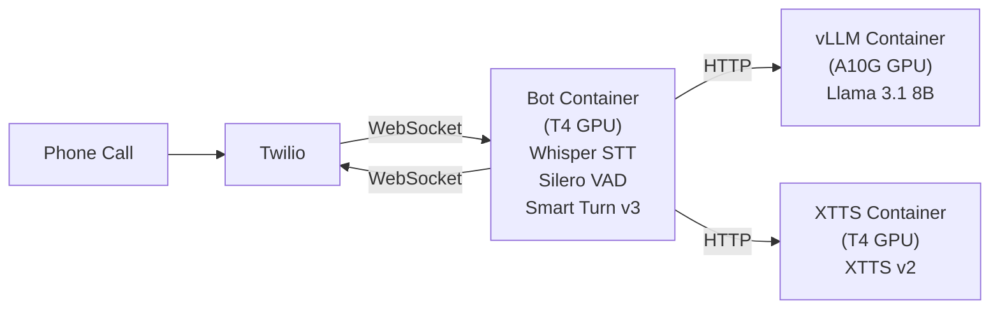

# Going Off-Grid: Replacing API Services with Self-Hosted Open-Source Models

I ended the [last post](blog-latency.md) with a question: *what if you could run your own STT, LLM, and TTS, eliminating the network hops entirely? Would self-hosting actually be faster - and at what cost?*

It's a tempting idea. No API keys to manage. No rate limits to worry about. No per-request billing from three different providers. Full control over every model, every parameter, every GPU. And maybe - just maybe - lower latency, since you're cutting out all those network round-trips between your server and external APIs.

But there's a catch. When you self-host, you become the ops team. You're deploying GPU containers, managing model downloads, building custom servers, and debugging cold starts. The question isn't just "can I do it?" - it's "is it worth it?"

I decided to find out. This is Part 1 of that experiment: replacing every API service in the voice bot with a self-hosted open-source alternative, deployed on Modal GPUs. In Part 2, I'll run the latency comparison to answer the speed question.

## The Three Swaps

The API-based bot from the previous posts uses three external services: Deepgram for speech-to-text, Groq for the LLM, and Deepgram again for text-to-speech. Each one is a network call to a third-party API.

Here's what I replaced them with:

| Component | API-based | Self-hosted |
|-----------|-----------|-------------|
| **STT** | Deepgram nova-3 (streaming API) | Faster-Whisper large-v3-turbo (in-process) |
| **LLM** | Groq Llama 3.3 70B (API) | vLLM + Llama 3.1 8B (self-hosted) |
| **TTS** | Deepgram aura-2-theia-en (API) | XTTS v2 (self-hosted) |

Everything else stays the same: Silero VAD, Smart Turn v3, RNNoise, the Twilio WebSocket transport, and the latency observers from the previous post. The pipeline structure is identical - I'm just swapping which services sit in each slot.

The architecture looks like this - three separate Modal containers, each with its own GPU:



Why separate containers? Each service has different GPU memory requirements. vLLM needs an A10G (24GB VRAM) for the LLM, while Whisper and XTTS each fit comfortably on cheaper T4s (16GB). Modal's per-second billing means idle containers cost nothing, so there's no penalty for splitting them up.

## Deploying vLLM - The LLM Server

The LLM was the easiest swap. vLLM exposes an OpenAI-compatible API out of the box, which means Pipecat's `OLLamaLLMService` (which extends `OpenAILLMService`) can connect to it without any changes. You just point it at a different URL.

Here's the entire Modal deployment for vLLM:

```python
MODEL = "meta-llama/Meta-Llama-3.1-8B-Instruct"
GPU = "A10G"

app = modal.App("self-hosted-vllm")
model_volume = modal.Volume.from_name("vllm-model-cache", create_if_missing=True)

image = (
    modal.Image.debian_slim(python_version="3.12")
    .pip_install("vllm")
)

@app.function(
    image=image, gpu=GPU,
    volumes={"/models": model_volume},
    secrets=[modal.Secret.from_dotenv(__file__)],
    scaledown_window=300, timeout=600,
)
@modal.web_server(port=8000, startup_timeout=300)
def serve():
    subprocess.Popen([
        "vllm", "serve", MODEL,
        "--host", "0.0.0.0", "--port", "8000",
        "--dtype", "auto", "--max-model-len", "8192",
        "--download-dir", "/models", "--enforce-eager",
    ])
```

A few things worth noting. The `model_volume` is a persistent Modal Volume that caches the downloaded model weights. Without it, every cold start would re-download the 16GB model from HuggingFace - not fun. The `startup_timeout=300` gives vLLM five minutes to load the model on first deploy.

Since Llama 3.1 8B is a gated model on HuggingFace, you need a `HF_TOKEN` in your `.env` file. The `secrets=[modal.Secret.from_dotenv(__file__)]` line makes that token available to vLLM at runtime.

After deploying with `modal deploy modal_vllm.py`, you can verify it's working:

```sh
curl https://<your-workspace>--self-hosted-vllm-serve.modal.run/v1/models
```

If you get back a JSON list with your model name, you're good.

## XTTS v2 - Rolling Your Own TTS

Text-to-speech was the most interesting swap. XTTS v2 is an open-source model from Coqui that supports streaming audio generation and voice cloning. But unlike vLLM, there's no standard server you can just deploy. I needed to build a minimal FastAPI server that matches the API contract Pipecat's `XTTSService` expects.

The contract is simple - just two endpoints:

- `GET /studio_speakers` - returns pre-computed speaker embeddings (voice profiles)
- `POST /tts_stream` - takes text and a speaker embedding, streams back raw PCM audio

The streaming endpoint is the interesting one. It takes text, runs it through the XTTS model, and yields audio chunks as they're generated - no need to wait for the entire sentence to be synthesised before sending the first audio:

```python
@app.post("/tts_stream")
async def tts_stream(request: Request):
    data = await request.json()
    text = data.get("text", "")
    speaker_embedding = data.get("speaker_embedding")
    gpt_cond_latent = data.get("gpt_cond_latent")

    # Convert lists back to tensors
    speaker_tensor = torch.tensor(speaker_embedding).unsqueeze(0).unsqueeze(-1).to(model.device)
    latent_tensor = torch.tensor(gpt_cond_latent).unsqueeze(0).to(model.device)

    def generate():
        chunks = model.inference_stream(text, "en", latent_tensor, speaker_tensor)
        for chunk in chunks:
            audio_np = chunk.cpu().numpy()
            pcm_data = (audio_np * 32767).astype(np.int16).tobytes()
            yield pcm_data

    return StreamingResponse(generate(), media_type="audio/raw")
```

The XTTS model ships with a set of pre-computed speaker voices (like "Claribel Dervla", the one I'm using). These are loaded from a `speakers_xtts.pth` file at startup, and each speaker is a pair of tensors - a speaker embedding and a GPT conditioning latent - that tell the model what voice to use.

One lesson I learned: pre-download the model during the Docker image build. XTTS v2 is about 2GB, and downloading it on every cold start adds minutes of delay. In the Modal deployment, I handle this with a single line in the image definition:

```python
.run_commands("python -c \"from TTS.api import TTS; TTS('tts_models/multilingual/multi-dataset/xtts_v2')\"")
```

This runs during `modal deploy`, so the model is baked into the container image. First request after a cold start? About two minutes for the model to load into GPU memory. But no download needed.

## Whisper STT - No Network Hop

Here's the biggest architectural difference between the two stacks. In the API version, speech-to-text goes through Deepgram's cloud service - your audio travels over the network, gets transcribed on Deepgram's servers, and the text comes back. In the self-hosted version, Whisper runs *in-process* on the same container as the bot. Zero network hop.

But there's a fundamental trade-off. Deepgram is a streaming STT - it starts returning partial transcriptions while you're still speaking. Whisper is batch-mode - it waits until you stop speaking (detected by the VAD), then transcribes the entire utterance at once. This means Whisper's clock doesn't start until after the VAD fires, while Deepgram has been working in parallel the whole time.

Does this matter for latency? That's exactly what we'll measure in Part 2. For now, here's how simple the swap is in the bot code:

```python
# API version (latency/bot.py):
stt = DeepgramSTTService(api_key=os.getenv("DEEPGRAM_API_KEY"), live_options=LiveOptions(model="nova-3"))

# Self-hosted version (self-hosted/bot.py):
stt = WhisperSTTService(model=Model.LARGE_V3_TURBO, device="cuda", compute_type="float16")
```

One line. Same pipeline position, same role, completely different architecture underneath. Pipecat's abstraction makes the swap painless. The `LARGE_V3_TURBO` model is a good balance of speed and accuracy - it's a distilled version of Whisper large-v3 that's significantly faster without much quality loss.

## Wiring It Together

This is the satisfying part. After all the infrastructure work - deploying vLLM, building the XTTS server, configuring Whisper - the actual bot code is almost identical to the API version. Here's the pipeline:

```python
pipeline = Pipeline([
    transport.input(),   # WebSocket input from Twilio
    stt,                 # Whisper (in-process, was Deepgram API)
    user_aggregator,
    llm,                 # vLLM via HTTP (was Groq API)
    tts,                 # XTTS v2 via HTTP (was Deepgram API)
    transport.output(),  # WebSocket output to Twilio
    assistant_aggregator,
])
```

Compare that to the API version from the latency bot:

```python
pipeline = Pipeline([
    transport.input(),   # WebSocket input from Twilio
    stt,                 # Deepgram API
    user_aggregator,
    llm,                 # Groq API
    tts,                 # Deepgram API
    transport.output(),  # WebSocket output to Twilio
    assistant_aggregator,
])
```

Identical structure. The VAD, Smart Turn v3, RNNoise noise filter, context aggregators, event handlers - all unchanged. And the same three latency observers from the [previous post](blog-latency.md) are wired in, ready for the comparison in Part 2:

```python
observers=[
    MetricsLogObserver(),
    UserBotLatencyLogObserver(),
    LatencyBreakdownObserver(),
],
```

This is what a good framework abstraction looks like. The infrastructure underneath changed completely - from cloud APIs to self-hosted GPU containers - but the application code barely noticed.

## Running It Locally

Not everyone has a Modal account, and sometimes you just want to tinker locally. So I also set up a Docker Compose stack that runs the entire thing on your machine - no GPU required.

The stack has three containers:

```yaml
services:
  ollama:          # LLM server (Llama 3.1 8B)
    image: ollama/ollama
  xtts:            # TTS server (XTTS v2, CPU mode)
    build: { dockerfile: Dockerfile.xtts }
    environment: [TTS_DEVICE=cpu]
  bot:             # Pipecat bot with Whisper STT (CPU mode)
    build: .
    environment:
      - WHISPER_DEVICE=cpu
      - WHISPER_COMPUTE_TYPE=int8
      - LLM_MODEL=llama3.1:8b
      - VLLM_BASE_URL=http://ollama:11434/v1
      - XTTS_BASE_URL=http://xtts:8001
```

Instead of vLLM, the local stack uses Ollama for the LLM. Same model (Llama 3.1 8B), different serving software. Ollama handles its own model downloads, so no HuggingFace token needed.

Everything runs on CPU, which is slower but functional. Whisper uses `int8` quantisation for speed on CPU. XTTS is noticeably slower without a GPU - expect higher TTS latency. But for development and testing, it works.

If you're on a Mac with Apple Silicon, there's also a native option. Running Ollama natively gives you Metal GPU acceleration for the LLM. The XTTS server supports PyTorch's MPS backend (`TTS_DEVICE=mps`), and Whisper can use the MLX framework (`WHISPER_DEVICE=mlx`) for GPU-accelerated transcription. This is significantly faster than the Docker stack, which can't access the Mac's GPU.

## What's Next

The self-hosted stack is running. It answers phone calls. Miss Harper still introduces herself, still chats about elementary school subjects, still tells stories when asked. From the caller's perspective, nothing has changed.

But under the hood, everything is different. Three API calls replaced by two HTTP calls to my own GPU containers and one in-process inference. No external API keys needed (except Twilio for the phone line). Full control over every model.

The question from the last post still stands, though: *is it actually faster?*

The latency observers are already wired in and collecting data on every call. In Part 2, I'll deploy both bots side by side on Modal, make test calls to each, and compare the latency breakdown tables head to head. Where does the self-hosted stack win? Where does it lose? And is the trade-off worth it?

Time to find out.
